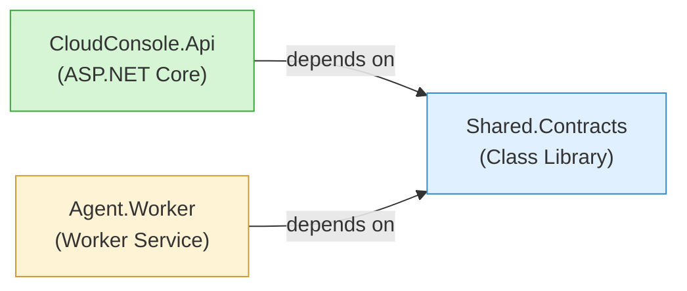
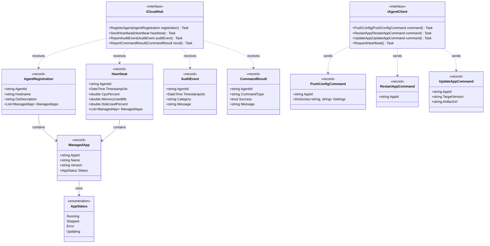
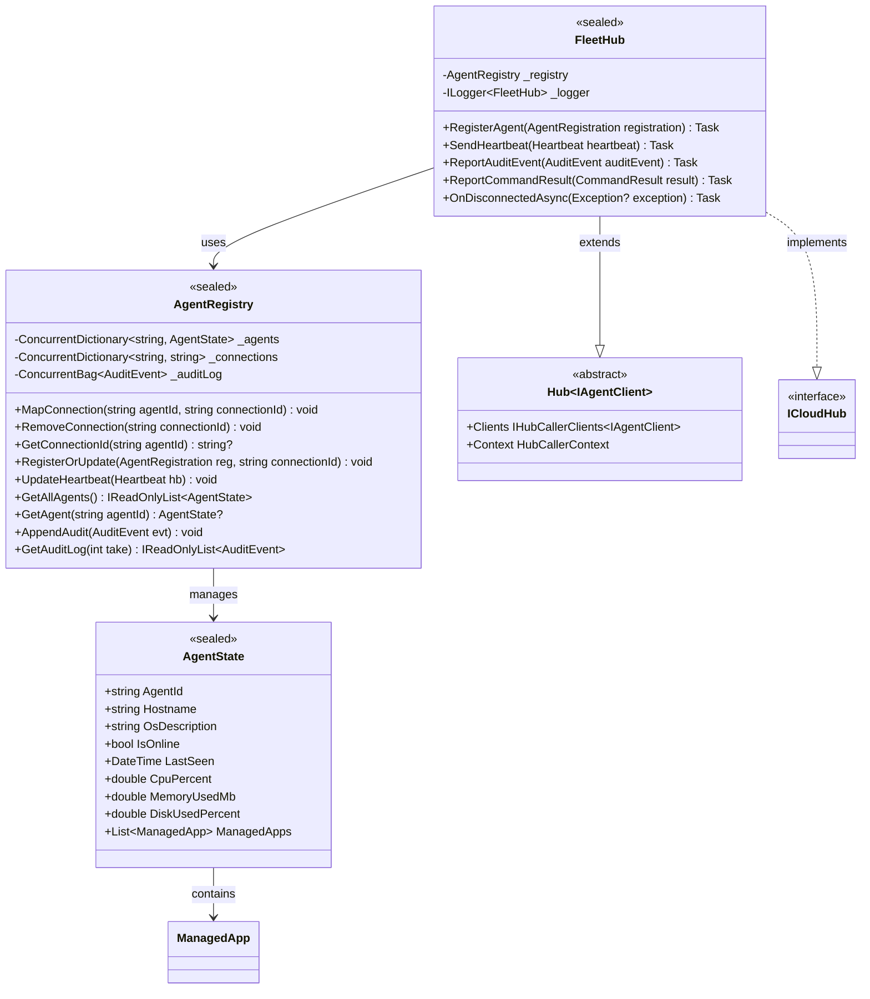
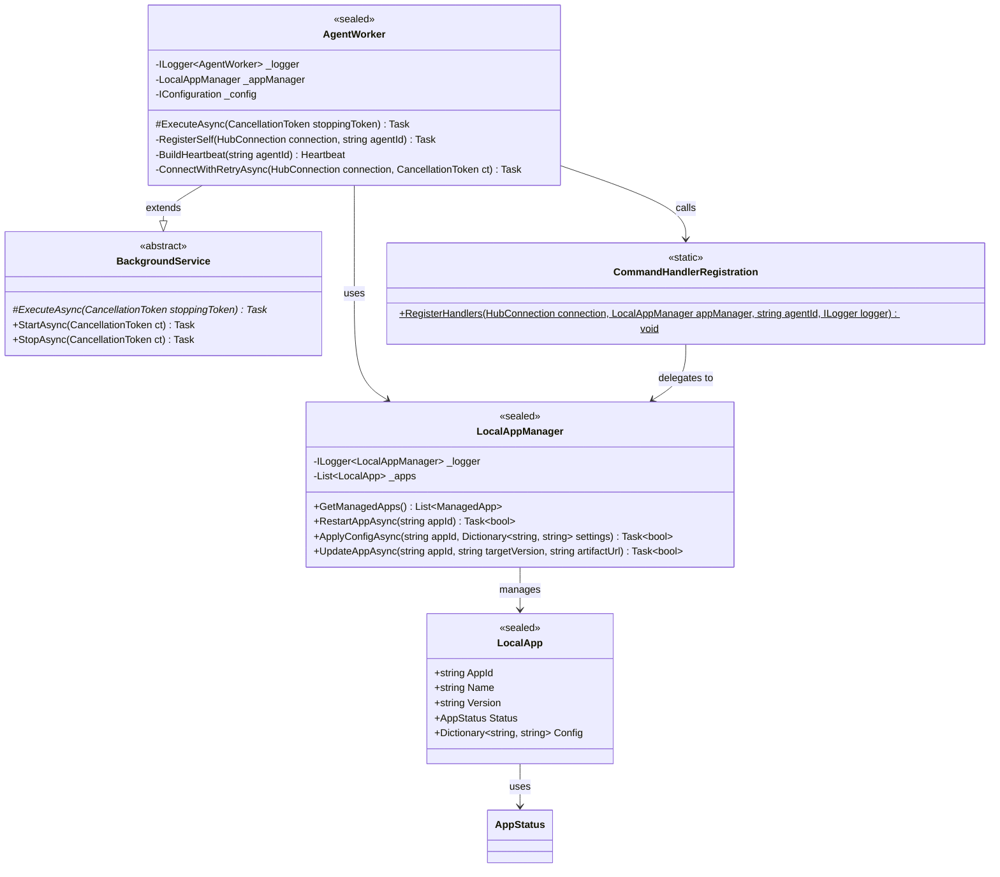
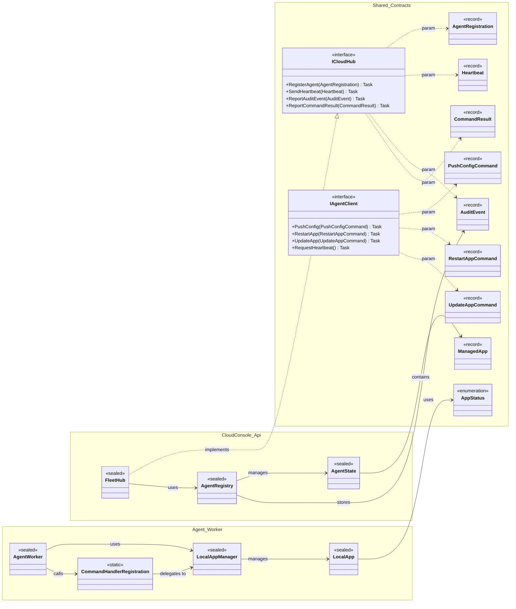
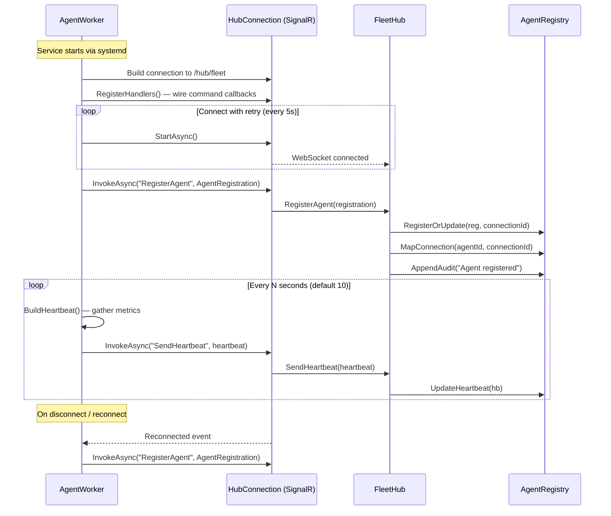
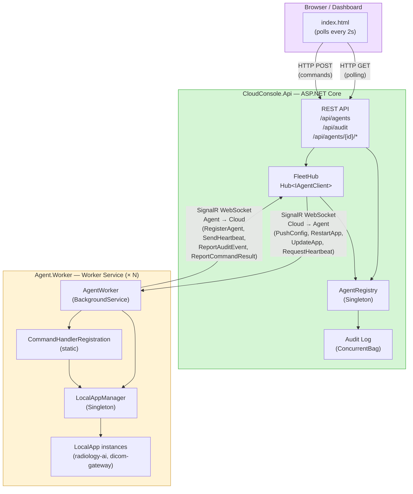
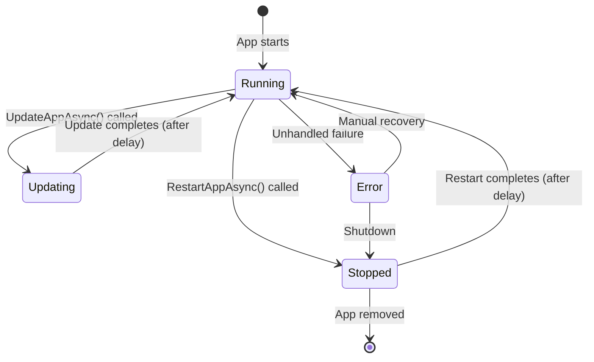
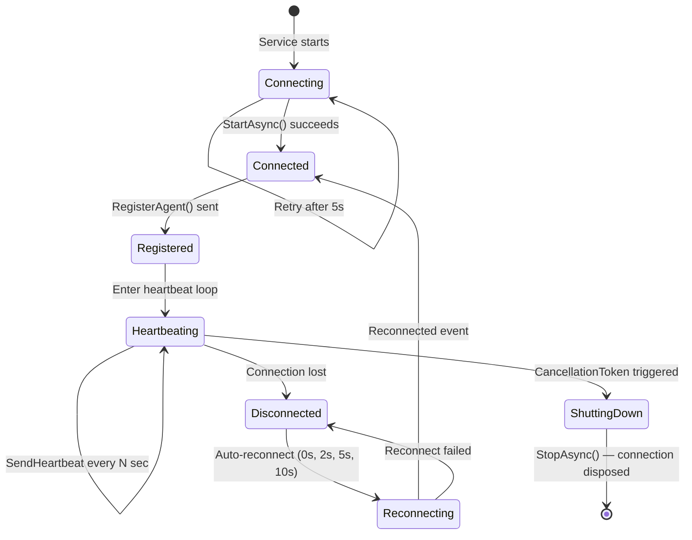

# FleetManager — OOP Architecture UML

This document describes the object-oriented architecture of FleetManager using Mermaid UML diagrams. It covers the class structure, project dependencies, communication flow, and runtime behaviour.

---

## Table of Contents

1. [Project Dependency Diagram](#project-dependency-diagram)
2. [Class Diagram — Shared.Contracts](#class-diagram--sharedcontracts)
3. [Class Diagram — CloudConsole.Api](#class-diagram--cloudconsoleapi)
4. [Class Diagram — Agent.Worker](#class-diagram--agentworker)
5. [Full Class Relationship Diagram](#full-class-relationship-diagram)
6. [Sequence Diagram — Agent Registration & Heartbeat](#sequence-diagram--agent-registration--heartbeat)
7. [Sequence Diagram — Cloud Command Execution](#sequence-diagram--cloud-command-execution)
8. [Component Diagram](#component-diagram)
9. [State Diagram — AppStatus](#state-diagram--appstatus)
10. [State Diagram — Agent Lifecycle](#state-diagram--agent-lifecycle)

---

## Project Dependency Diagram

Shows the compile-time dependency rule: both executable projects depend on `Shared.Contracts` but never reference each other.



---

## Class Diagram — Shared.Contracts

DTOs, hub interfaces, and enums shared by both cloud and agent projects.



---

## Class Diagram — CloudConsole.Api

The cloud-side server: SignalR hub, agent registry, and REST API endpoints.



---

## Class Diagram — Agent.Worker

The agent-side daemon: background worker, command handlers, and local app management.



---

## Full Class Relationship Diagram

A consolidated view of all types across the three projects and their relationships.



---

## Sequence Diagram — Agent Registration & Heartbeat

Shows the startup flow when an agent connects to the cloud console.



---

## Sequence Diagram — Cloud Command Execution

Shows the flow when an operator sends a command (e.g. restart) through the REST API.

```mermaid
sequenceDiagram
    participant Browser as Browser / cURL
    participant API as REST Endpoint
    participant Registry as AgentRegistry
    participant Hub as FleetHub (IAgentClient proxy)
    participant Agent as AgentWorker
    participant Handler as CommandHandlerRegistration
    participant AppMgr as LocalAppManager

    Browser->>API: POST /api/agents/{id}/restart-app<br/>{ "appId": "radiology-ai" }
    API->>Registry: GetConnectionId(agentId)
    Registry-->>API: connectionId (or null → 404)

    API->>Hub: Clients.Client(connectionId).RestartApp(command)
    API->>Registry: AppendAudit("Restart requested")
    API-->>Browser: 202 Accepted

    Hub->>Agent: SignalR invokes RestartApp handler
    Agent->>Handler: On&lt;RestartAppCommand&gt; callback
    Handler->>AppMgr: RestartAppAsync(appId)
    AppMgr->>AppMgr: Status = Stopped → delay → Status = Running
    AppMgr-->>Handler: true (success)

    Handler->>Hub: InvokeAsync("ReportCommandResult", result)
    Hub->>Registry: (via FleetHub) AppendAudit(result)

    Handler->>Hub: InvokeAsync("ReportAuditEvent", auditEvent)
    Hub->>Registry: (via FleetHub) AppendAudit(auditEvent)
```

---

## Component Diagram

High-level architectural view of the system components and their communication channels.



---

## State Diagram — AppStatus

Lifecycle states a managed application can transition through.



---

## State Diagram — Agent Lifecycle

Connection lifecycle of an agent from startup to graceful shutdown.


